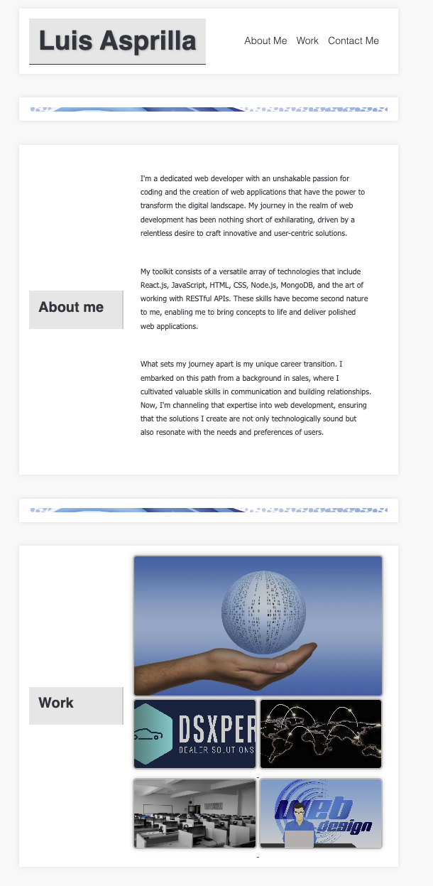

# Portfolio README

## Description

This repository contains the code for my personal portfolio website. The motivation behind creating this project is to showcase my skills as a web developer and provide a platform where others can learn more about me, explore my work, and easily get in touch.

## Table of Contents

- [Installation](#installation)
- [Usage](#usage)
- [Credits](#credits)
- [License](#license)
- [Badges](#badges)
- [Features](#features)
- [How to Contribute](#how-to-contribute)
- [Tests](#tests)

## Installation

To run this project locally, follow these steps:

1. Clone the repository to your local machine.
   ```bash
   git clone https://github.com/anderson0626/portfolio.git
   
   cd portfolio
2. Open the index.html file in your preferred web browser.




